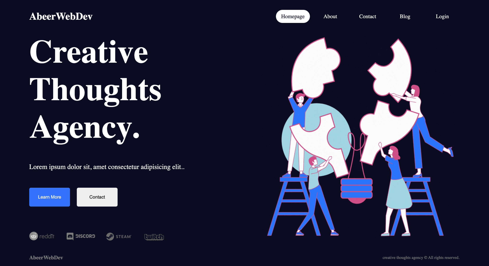
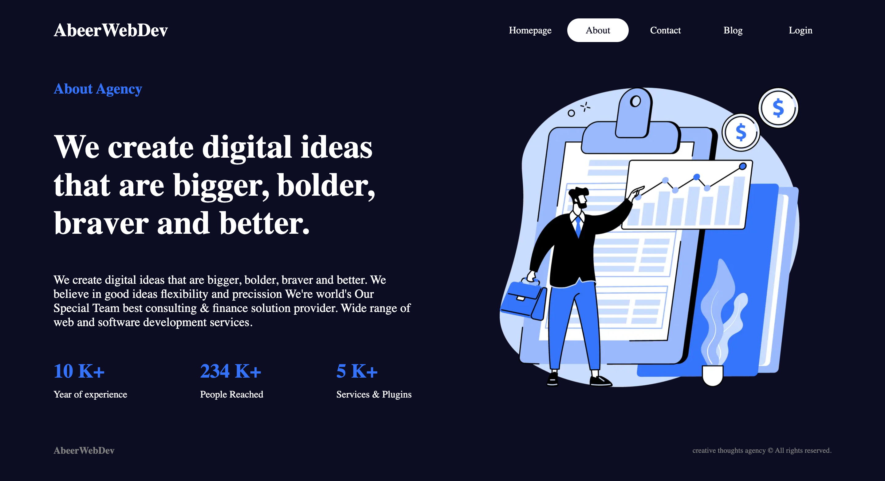
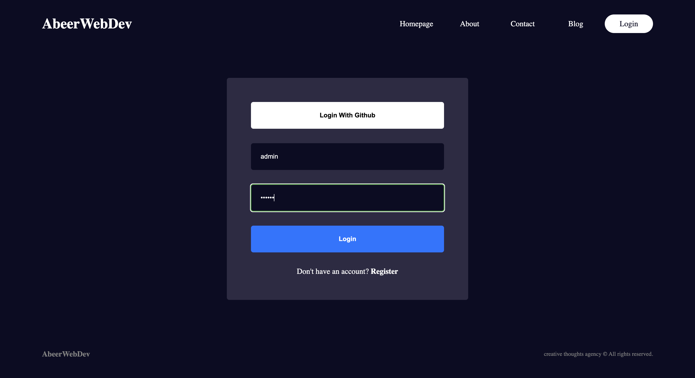
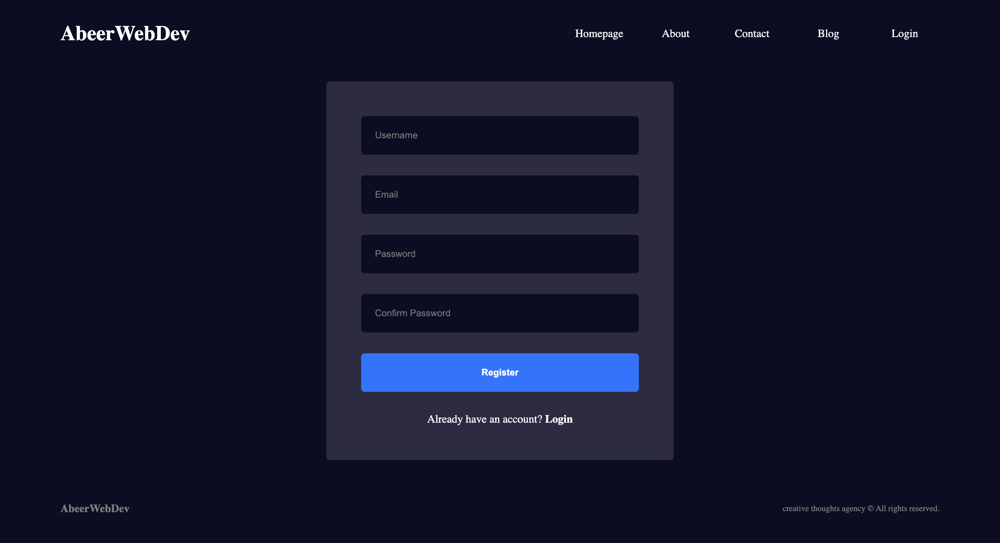
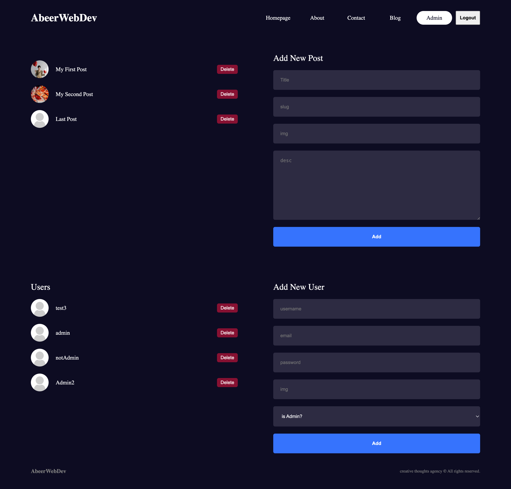
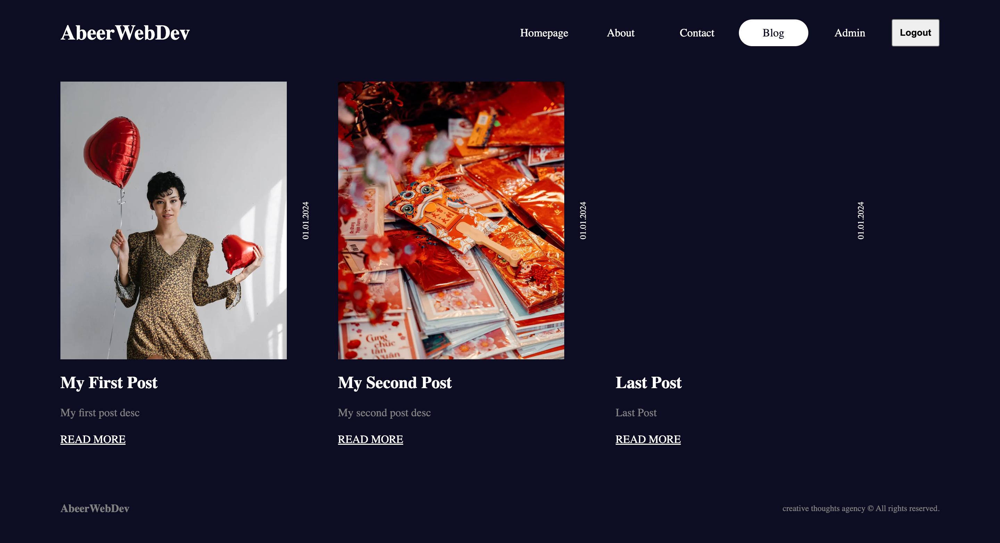
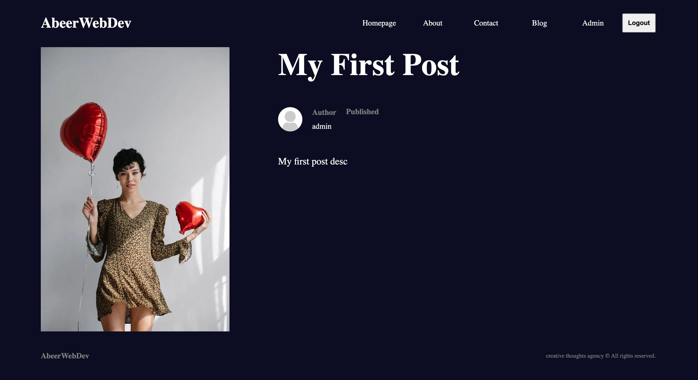

# Next.js 14 Blog with Admin Quality and Authentication

## Table of Contents
* [General Information](#general-information)
* [Technologies Used](#technologies-used)
* [Features](#features)
* [Screenshots](#screenshots)
* [Installation and Setup Instructions](#installation-and-setup-instructions)
* [Usage](#usage)
* [Project Status](#project-status)
* [Room for Improvement](#room-for-improvement)
* [Acknowledgements](#acknowledgements)
* [Contact](#contact)

## General Information
Next.js 14 Blog is a powerful web application that enables users to create and manage a sophisticated blog with admin-level capabilities. Built on Next.js 14, this project also integrates authentication using NextAuth.js for a secure and seamless user experience.

### Purpose of this Project
The primary goal of this project is to provide users with a high-quality blogging platform that includes advanced features and a robust admin interface. The authentication system ensures that user data is secure and the platform is accessible to registered users.

## Technologies Used
* Next.js 14
* MongoDB
* Mongoose
* React
* React DOM
* NextAuth.js
* bcryptjs

## Features
* Advanced user registration and login with username or Github account.
* Secure logout functionality.
* Extensive admin-quality blog with features like post management.
* User-friendly authentication options for a seamless experience.

## Screenshots
**Home Page**

**About Page**

**Login Page**

**Registration Page**

**Admin Dashboard**

**Posts Page**

**Single Post Page**

## Installation and Setup Instructions
To set up the Next.js 14 Blog on your local machine, follow these steps:

1. Clone this repository.
2. Ensure Node.js and npm are installed.
3. Install project dependencies: `npm install` or `yarn install`.
4. Configure your MongoDB database connection.
5. Set up authentication settings for NextAuth.js.
6. Start the development server: `npm run dev` or `yarn dev`.
7. Access the application in your web browser at `http://localhost:3000`.

## Usage
### User Registration and Login
* Users can register with a username or log in using their Google account.

### Admin-Quality Blog
* Enjoy an admin-level blog with advanced features.

### Dashboard
* Access a comprehensive admin dashboard for managing blog posts.

## Project Status
Next.js 14 Blog is currently in active development.

## Room for Improvement
* Continuously enhance the user interface and user experience.
* Consider adding features like comments and user profiles.

## Acknowledgements
Special thanks to the Next.js and MongoDB communities for their invaluable contributions and tools.

## Contact
Created by Abeer - [LinkedIn profile](https://www.linkedin.com/in/abeerwebdev/) - Feel free to contact me.
